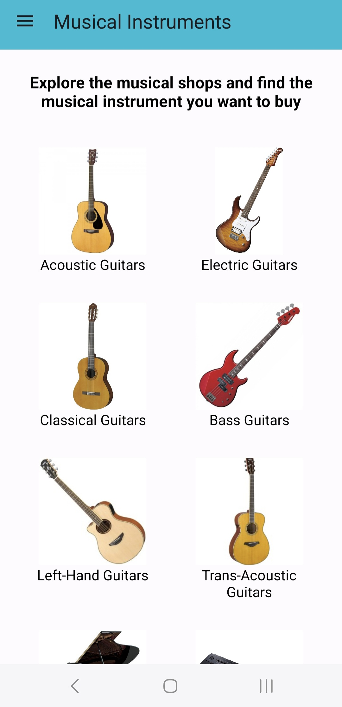
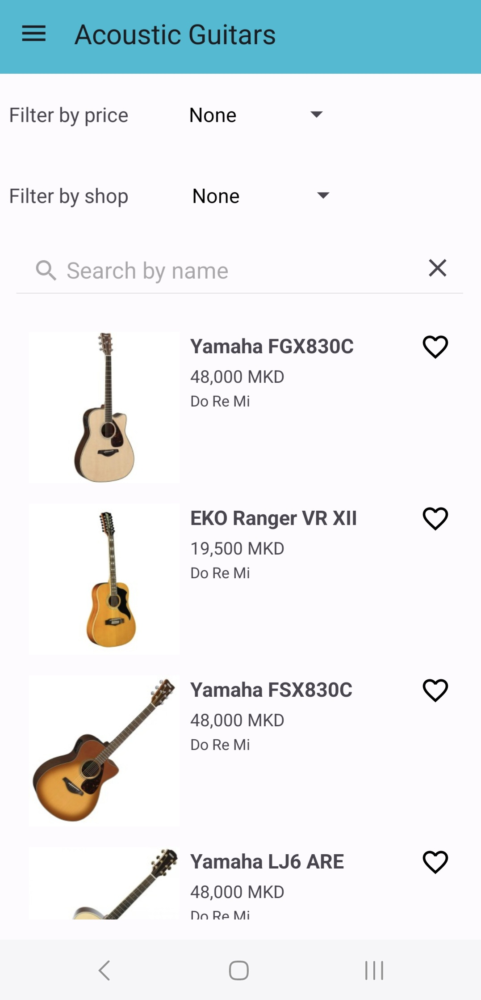
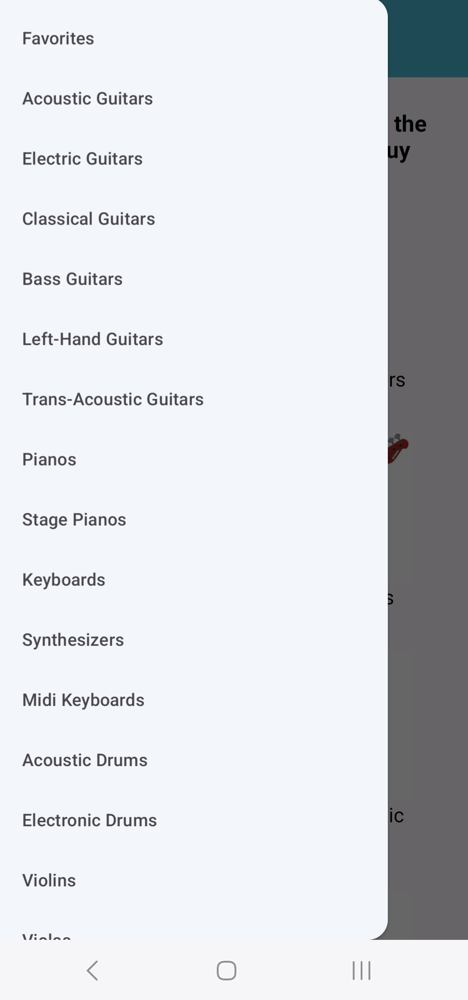
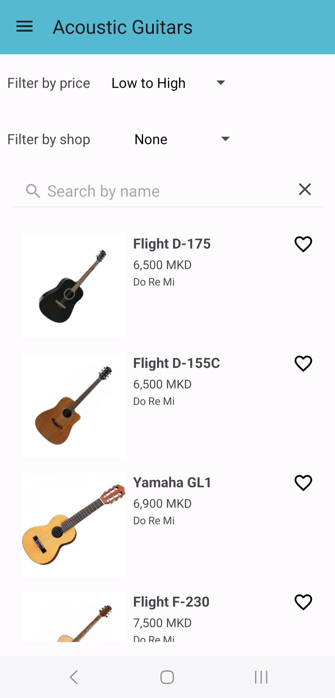
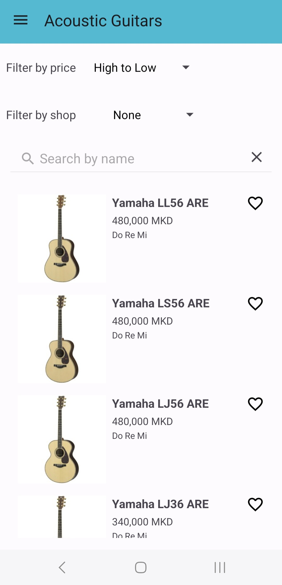
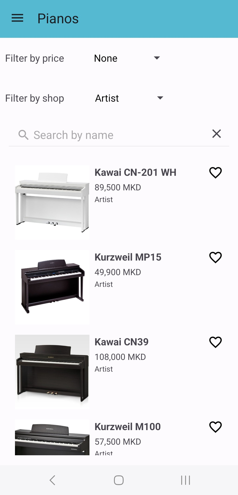
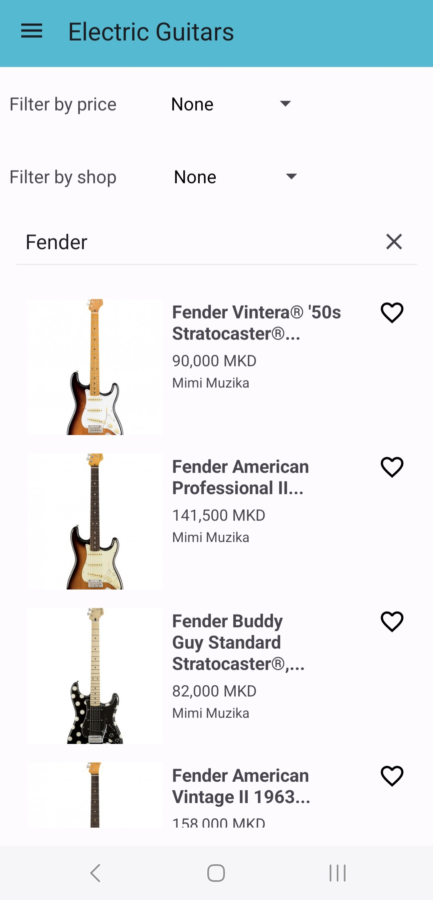
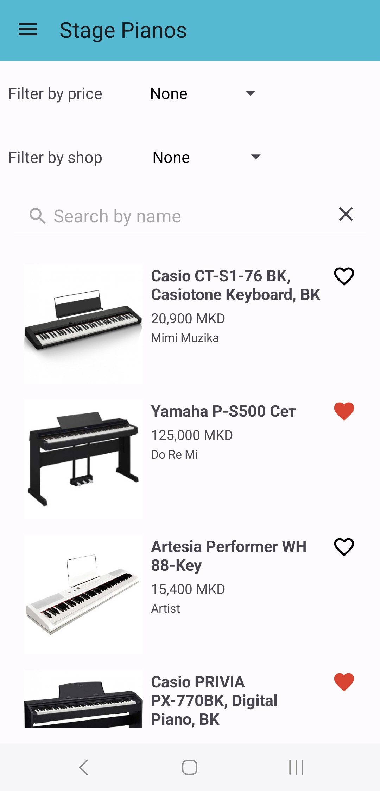
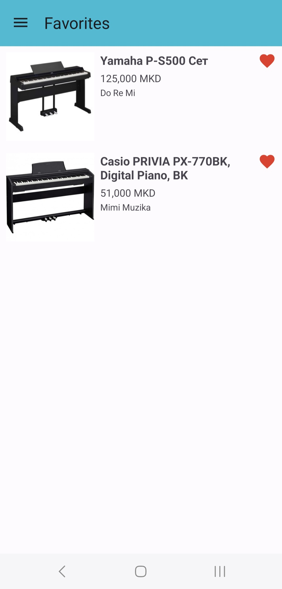

## Musical Instruments Aggregator

**Musical Instruments Aggregator** is an Android mobile app built in **Kotlin** using **Android Studio**.  
The app allows users to explore musical instruments from three shops: **Do Re Mi**, **Artist**, and **Mimi Muzika**.  

Users can:
- Browse instruments by category
- Filter by price and shop 
- View detailed information about each 3 musical shops 
- Save and manage their favorite instruments (persisted using **SharedPreferences**)  

The app is designed to help music enthusiasts easily explore instruments across multiple local stores from one place, making it simpler to find and choose the one that best fits their needs.

##  How It Works

### 1. Data Collection 
- Instrument data is scraped from the three shops (**Do Re Mi**, **Artist**, **Mimi Muzika**) using a custom script.  
- The scraped data (name, category, price, shop, description, and URL) is stored in a **CSV file**.  
- The CSV file is then uploaded to **Firebase**, making it accessible for the app.

### 2. Data Loading
- When the app starts, it retrieves the instrument data from Firebase.  
- Data is displayed in a RecyclerView, allowing users to browse instruments by category (e.g., acoustic guitars, electric guitars, pianos, drums) and explore items from multiple shops. A convenient sidebar menu also lets users jump directly to a category or open their Favorites section.
  
  

   &nbsp;
   &nbsp;
   &nbsp;

### 3. Filtering 
- The app provides filtering options on the instrument list screen:  

  - **By Price** → Sort instruments from low to high or high to low.  
    

       &nbsp;
      
    

  - **By Shop** → Display only instruments from a selected shop.  
    

      
    

  - **Search Filter** → Allows users to quickly find instruments by typing part of the name. The list updates in real time to show only matching results.  
    

      
    

- Filtering is applied dynamically on the loaded data, so results are updated instantly without reloading the app.

### 4. Favorites Persistence
- Users can save instruments to their **Favorites** list.
    

       &nbsp;
    

- Favorites are stored locally using **SharedPreferences**, ensuring they remain available even after the app is restarted.
     

        &nbsp;
     

### 5. Instrument Links
- When a user taps on an instrument in the list, the app immediately opens the original product page on the shop’s website.  
- This is handled using an **implicit intent** to launch the browser with the instrument’s URL.

